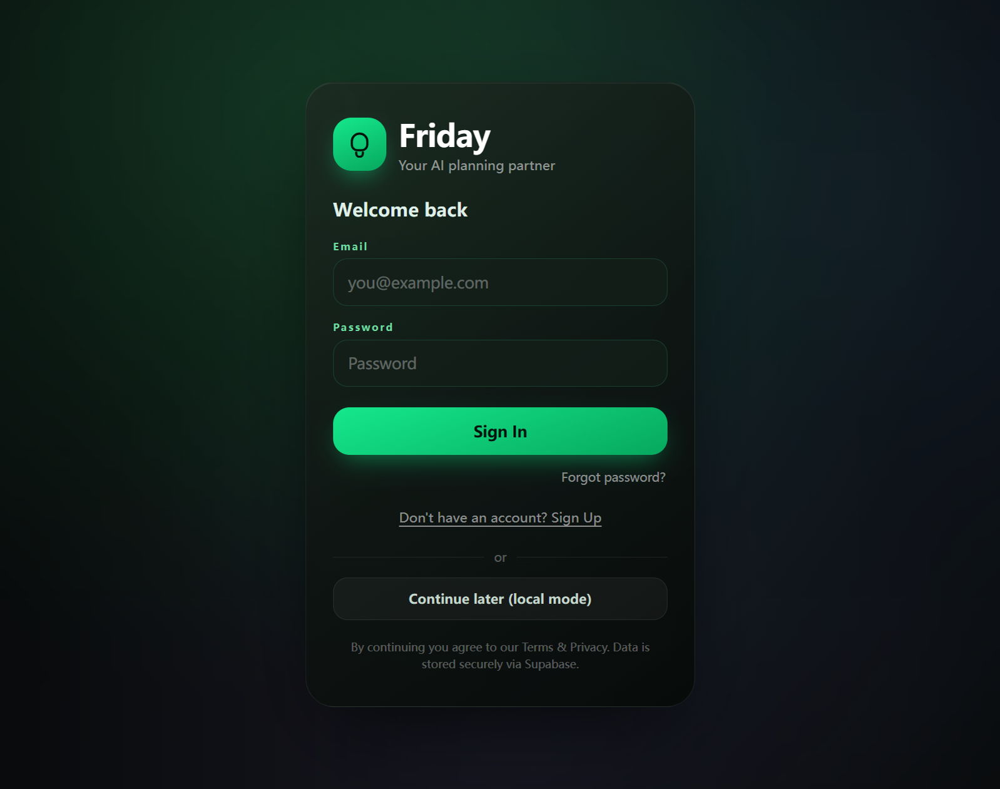
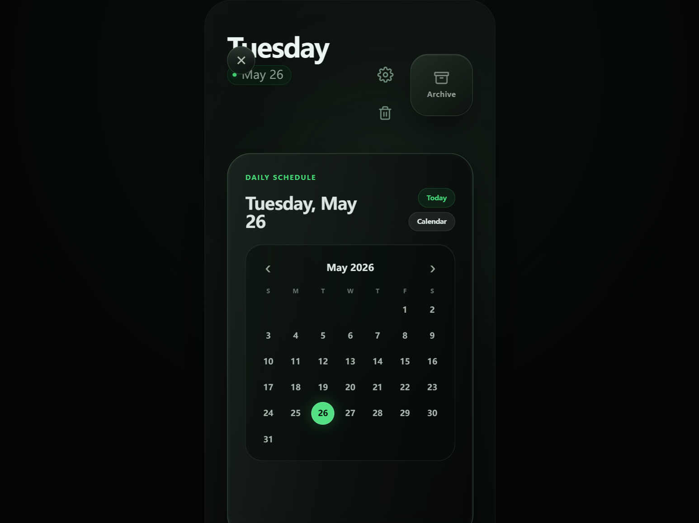
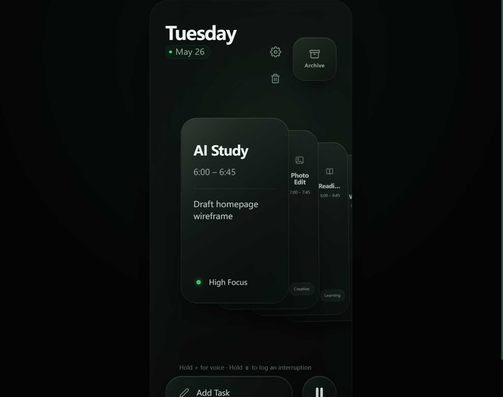
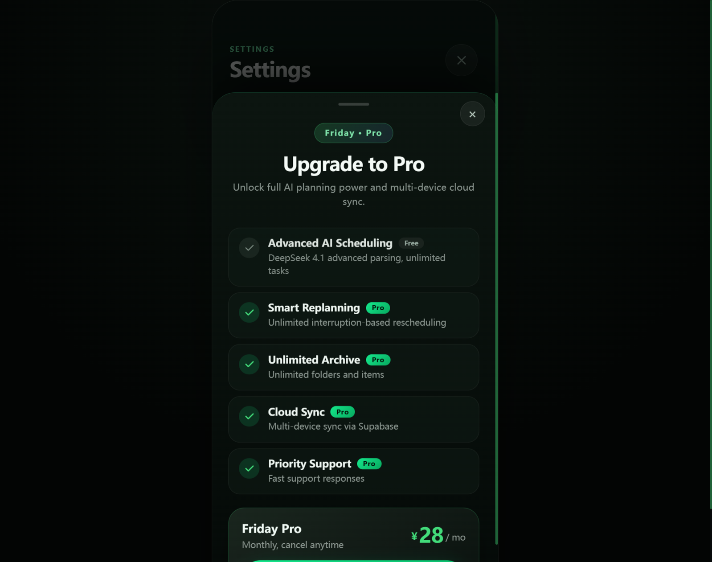
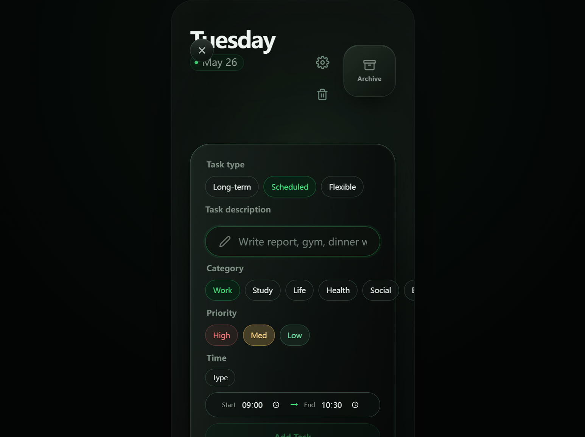
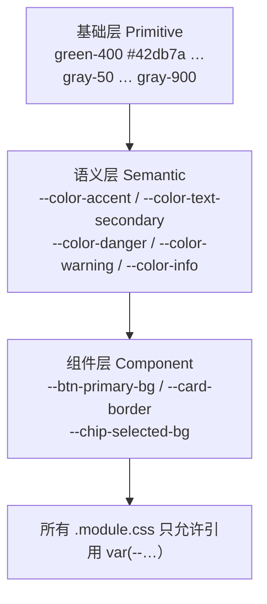

# Friday UI 全面优化分析与设计方案

> 版本：v1.0 ｜ 日期：2026-09-26 ｜ 分析对象：Friday Web / iOS（Capacitor）当前构建产物
> 分析方式：真实页面走查（11 张实测截图）+ 全部 24 个样式文件静态审计 + 设计令牌（Design Token）覆盖率统计
> 截图目录：[docs/ui-review/](docs/ui-review/)（可与本文对照查看）

---

## 0. 评估范围与方法

| 项 | 说明 |
|---|---|
| 覆盖界面 | 登录/注册、首页（轮播）、任务详情、任务编辑、新建任务、日程+日历、归档（3D 文件夹）、设置、回收站、订阅面板 |
| 设备视角 | 桌面浏览器 977×771 实测；代码审计移动断点 ≤430px；iOS 逻辑分辨率 393×852 为设计基准 |
| 审计维度 | 视觉设计（色彩/排版/质感）、交互体验、响应式、无障碍、渲染性能 |
| 量化数据 | 硬编码色值 **313 处/24 文件**；`backdrop-filter` **45 处/20 文件**；8–11px 微文字 **40 处**；响应式断点**仅 1 个** |

截图索引：

| 编号 | 界面 | 文件 |
|---|---|---|
| 01 | 登录/注册 | [ui-01-auth.png](docs/ui-review/ui-01-auth.png) |
| 02 | 首页（桌面窗口） | [ui-02-home-desktop.png](docs/ui-review/ui-02-home-desktop.png) |
| 03 | 首页（主界面） | [ui-03-home.png](docs/ui-review/ui-03-home.png) |
| 04 | 任务详情 | [ui-04-task-detail.png](docs/ui-review/ui-04-task-detail.png) |
| 05 | 归档 3D 文件夹 | [ui-05-archive.png](docs/ui-review/ui-05-archive.png) |
| 06 | 新建任务 | [ui-06-add-task.png](docs/ui-review/ui-06-add-task.png) |
| 07 | 日程 + 日历 | [ui-07-schedule.png](docs/ui-review/ui-07-schedule.png) |
| 08 | 设置 | [ui-08-settings.png](docs/ui-review/ui-08-settings.png) |
| 09 | 回收站（空态） | [ui-09-trash.png](docs/ui-review/ui-09-trash.png) |
| 10 | 订阅面板 | [ui-10-subscription.png](docs/ui-review/ui-10-subscription.png) |
| 11 | 任务编辑 | [ui-11-editor.png](docs/ui-review/ui-11-editor.png) |

---

## 1. UI 现状评估

### 1.1 总体印象

Friday 的视觉方向是明确且有品质感的：**深色「液态玻璃（Liquid Glass）」+ 翡翠绿强调色 + 3D 空间层次**。首页卡片堆叠、归档 3D 文件夹、完成态描边动画都体现了较强的设计意图，基础审美在线。

但工程实现与设计意图之间存在明显落差，集中表现为四句话：

1. **有令牌，不执行**——[tokens.css](src/styles/tokens.css) 定义了完整的颜色/圆角/间距/动效变量，但组件里普遍直接写死色值，同屏出现多种绿、十几种灰；
2. **按 393×852 一张「画」在做布局**——核心区域全部绝对定位 + 固定像素，换一个高度就裁切、换一个宽度就溢出；
3. **小而淡的文字偏多**——8–11px 文字共 40 处，部分次级文字对比度不足 WCAG AA；
4. **只适配了「一台手机」**——全局只有一个 430px 断点，平板、折叠屏、桌面短窗口、横屏均无正式布局。

### 1.2 视觉设计评估

#### 1.2.1 色彩：强调色不统一、中性色失控

设计令牌中主色只有一个：`--color-accent: #42db7a`（[tokens.css#L14](src/styles/tokens.css#L14)）。但实测代码中至少存在 **6 种「品牌绿」**：

| 色值 | 出现位置（示例） | 角色 |
|---|---|---|
| `#42db7a` | tokens、Settings、TaskDetail 归档按钮 | 令牌主色 |
| `#47db7a` | Header 状态点、TaskDetail eyebrow、日程激活态、AddTask 选中态 | 事实主色（用得最多） |
| `#15e88c → #07a85e` | 登录页 Logo 底、Sign In 按钮渐变 | 登录页专属更亮的绿 |
| `#6fdca0` | 各面板 eyebrow/标签文字 | 浅绿文字 |
| `#57da84` / `#55e589` | 日程状态、归档文件夹 activeMark | 又两种绿 |
| `rgb(51 214 112)` | 大量边框/发光（`#33d670`） | 绿色的第 6 副面孔 |

中性灰同样发散：`#929d97 / #8a958f / #b7c1bb / #b9c4be / #9eaaa3 / #dbe5e0 / #d6e0da / #c5d0c9 / #78877e / #718078 / #7e8b84 / #829087 / #859089 / #6f8a7c / #5f6f66 / #657169` 共 **16 种以上**近似灰，彼此色差多在 3–8% 之间，人眼几乎无法区分其层级意图，却让主题切换和统一调色变得不可能。

此外还有**游离的第二色相**：升级按钮使用 `#42db7a → #2aa8ff` 绿→蓝渐变（[SettingsPanel.module.css#L182](src/components/SettingsPanel.module.css#L182)、L200、L286），蓝色还出现在 AI 按钮、同步指示点上，但它在整个设计语言中没有正式身份。



*图 1-1：登录页主按钮为 `#15e88c` 霓虹亮绿，进入应用后主色变为 `#42db7a/#47db7a`，首屏即产生品牌色差*

#### 1.2.2 玻璃质感：参数各自为政

「玻璃面板」有统一类 [glass.css](src/styles/glass.css)，但大多数面板没有使用它，而是手写参数：

- 边框透明度：9% / 13% / 14% / 20% / 22% / 26% / 30% 至少 7 档；
- 模糊半径：8 / 10 / 16 / 22 / 24px 混用；
- 同类面板不同边：任务详情、新建任务、日程三个面板尺寸相近，却分别使用 28px / 32px / 32px 圆角和 26% / 30% / 26% 的不同边框。

视觉上可以在图 1-2（日程面板）看到比其他面板明显更「亮」的一圈描边。



*图 1-2：日程卡片边框为 `rgb(184 255 209 / 26%)`，比首页卡片 13% 的边框亮一倍，同屏玻璃「型号」不统一*

**性能侧**：全站 45 处 `backdrop-filter`（含 `-webkit-` 前缀），首页轮播可视范围内同时存在 4 张 `blur(24px) saturate(180%)` 的堆叠卡片。毛玻璃是移动端最昂贵的合成属性之一，在中低端 Android 上堆叠时容易造成滑动掉帧。

#### 1.2.3 排版：层级大胆，但微文字过多

- **标题层级质量好**：36px/700/-1.45px 字距的日期大标题、26–28px 卡片标题，气质统一，是当前视觉最成功的部分；
- **微文字泛滥**：全站 8–11px 文字 40 处。典型：日历星期头 8px（[CalendarPicker.module.css#L8](src/features/home/CalendarPicker.module.css#L8)）、日程状态 8px（[DailySchedule.module.css#L18](src/features/home/DailySchedule.module.css#L18)）、轮播侧卡时间 8px（[TaskCard.module.css#L41-L42](src/features/home/TaskCard.module.css#L41-L42)）、归档 3D 文件夹标题仅 **5.2px**（[ArchiveCategoryCard.module.css#L10](src/features/archive/ArchiveCategoryCard.module.css#L10)）；
- **中文字体未规划**：字体栈为 `Inter, system-ui...`（[global.css#L13](src/styles/global.css#L13)），Inter 不含中文字形，中文回落系统字体后，中英文混排在字重、字面率、基线上都有可感知的跳动；
- **深色模式写死，浅色模式半成品**：[global.css#L80-L117](src/styles/global.css#L80-L117) 提供了 `prefers-color-scheme: light` 覆盖，但 313 处硬编码深色十六进制值不会响应这些变量——浅色偏好用户会得到「浅背景 + 深色组件 + 深色文字」的混合界面。



*图 1-3：侧叠卡片时间文字 8px、分类胶囊 8px，第三张卡起标题被裁切（"Readi..."），装饰性强于可读性*

#### 1.2.4 对比度（无障碍）

对若干典型低对比文字按 WCAG 2.1 公式估算（底色取 `#0b0f0d`）：

| 文字 | 色值 | 位置 | 估算对比度 | 结论（AA 需 4.5:1） |
|---|---|---|---|---|
| 底部长按提示 | `#5f6f66` / 11px | [BottomControls.module.css#L3](src/features/home/BottomControls.module.css#L3) | ≈ 3.6:1 | 不达标 |
| 空态副文案 | `#657169` / 10px | DailySchedule `.empty span` | ≈ 3.8:1 | 不达标 |
| 卡片分类文字 | `#859089` / 10px | TaskCard `.categoryPill` | ≈ 4.6:1 | 勉强达标 |
| 回收站副文案 | 约 `#718078` | 图 09 | ≈ 4.6:1 | 勉强达标 |

好的一面：全站已有统一的 `:focus-visible` 描边（[global.css#L50-L53](src/styles/global.css#L50-L53)）、`prefers-contrast: more` 与 `prefers-reduced-motion` 适配，无障碍基础设施意识是有的。

### 1.3 交互体验评估

**优点（应保留）**：按压态 `scale(0.94~0.98)` 反馈普遍且克制；分段控件普遍带 `aria-pressed`；轮播支持键盘左右键并有 `aria-live` 状态播报；危险操作有二次确认；Toast 可 Undo；动效曲线统一收敛在 `cubic-bezier(0.22,1,0.36,1)`。

**主要问题**：

1. **核心手势缺少可发现性（Discoverability）**。长按「+」语音建任务、长按暂停记录打断、横向滑动切卡、点日期块进日程——四个高频操作全部隐藏，唯一提示是底栏上方一行 11px、对比度 3.6:1 的英文小字（图 03 底部 "Hold + for voice..."）。新用户首启没有任何引导。
2. **任务详情靠「点空白处关闭」**。遮罩是一个全透明 `<button>`（[HomeScreen.tsx#L156-L161](src/features/home/HomeScreen.tsx#L156-L161)），没有任何视觉暗示，也没有 X 按钮，用户只能凭经验点击卡片外侧。
3. **语义色冲突**：红色同时表示「高优先级」和「删除/危险」（图 06 High 红色 vs 图 04 Delete 红色）；琥珀色同时表示「中优先级」和「已暂停」（`#ffc96a` 与 [DailySchedule.module.css#L21](src/features/home/DailySchedule.module.css#L21) 的 `#d0b16b`）。颜色承担了两种互相矛盾的含义。
4. **订阅权益清单语义错误**：5 个权益行全部带对勾，其中「Advanced AI Scheduling」标着 Free 却是灰勾（图 1-4），用户无法分辨勾的含义；文案中还硬编码了模型名 "DeepSeek 4.1"。



*图 1-4：Free 项与 Pro 项同样显示对勾，仅以灰度区分，语义含混；底部 CTA 在 852px 高的框架内贴近下沿*

5. **死控件残留**：新建任务表单移除 Wheel 后，Time 区还剩一个孤零零的「Type」按钮（图 06，TSX 仍渲染单按钮切换组），CSS 里 `.wheelPreview` 等样式也未清理（[AddTaskForm.module.css#L45-L46](src/features/home/AddTaskForm.module.css#L45-L46)）；而任务编辑器里 Type/Wheel 双按钮都还在（图 11），两个入口行为不一致。

### 1.4 响应式表现评估（当前最薄弱环节）

布局以 393×852 为绝对基准，核心区域全部是定死的绝对定位：

| 元素 | 定位方式 | 出处 |
|---|---|---|
| 手机屏容器 | 固定 `width:393px; height:852px` | [HomeScreen.module.css#L1](src/features/home/HomeScreen.module.css#L1) |
| 顶栏 | `position:absolute; top:calc(42px + safe-area)` | [Header.module.css#L1-L7](src/components/Header.module.css#L1-L7) |
| 设置/回收站按钮 | `position:absolute; right:96px; top:36/88px` | Header.module.css#L68-L120 |
| 任务轮播 | `top:220px; left:30px; width:500px`（宽于屏幕 107px） | [TaskCarousel.module.css#L2-L4](src/features/home/TaskCarousel.module.css#L2-L4) |
| 任务详情 | `top:232px; left:30px; width:308px; height:450px` | [TaskDetail.module.css#L1](src/features/home/TaskDetail.module.css#L1) |
| 日程面板 | `top:206px; left:30px; width:333px; height:520px` | [DailySchedule.module.css#L1](src/features/home/DailySchedule.module.css#L1) |
| 底部 Dock | `position:absolute; bottom:32px`，主按钮固定宽 248px | [BottomControls.module.css#L1-L8](src/features/home/BottomControls.module.css#L1-L8) |

实测在 **977×771 的桌面浏览器窗口**下（高度仅比 852 小 81px），由于 `.appShell` 将 852px 的手机框垂直居中，上下同时溢出，**底部 Add Task / Pause 按钮被裁掉约一半**：


*图 1-5：窗口高度 771px 时，Add Task 按钮只剩上半截可见且不可点；PWA 桌面端、小窗模式必现*

断点策略方面：

- 全局实质只有 `@media (max-width: 430px)` 一个断点（外加 `hover`/对比度等能力查询）；
- **431–767px（小平板/大折叠屏外屏）**：看到的是居中的 393px 手机框 + 四周大块死黑，空间完全浪费；
- **≥1024px（桌面/平板横屏）**：无任何大屏布局，无两栏、无侧导航；
- **短屏/横屏**：移动规则是 `height: max(780px, 100vh)`（[HomeScreen.module.css#L11](src/features/home/HomeScreen.module.css#L11)），iPhone SE（667px 高）及任何横屏场景会被强制 780px，而内部元素仍是绝对定位，底部内容不可滚动到达；
- **320–360px 超窄屏**：仅 AddTaskForm 有一条 360px 微调，308px 宽的详情面板 + 两侧 30px gutter = 368px，320px 屏必然溢出。

#### 已实测的两个具体布局缺陷

**缺陷 A：关闭按钮与日期标题碰撞。** 所有全屏子面板（新建任务、日程）的关闭 X 位于左上角约 (42,42)，正好压在 36px 的 "Tuesday" 标题上：



*图 1-6：左上方关闭圆钮与 "Tuesday" 字标重叠（新建任务、日程面板均如此）*

**缺陷 B：分类选项横向溢出。** 新建任务的 Category 一排 7 个分段按钮使用不换行 flex 容器（[AddTaskForm.module.css#L26](src/features/home/AddTaskForm.module.css#L26)），Social 之后的 Entertainment 被直接裁出屏幕：


*图 1-7："Social / E…" 之后的选项超出 393px 屏宽，无法看到也无法点全*

### 1.5 各界面速评

| 界面 | 评分 | 一句话评价（详见截图） |
|---|---|---|
| 登录/注册 | ★★★★☆ | 完成度最高；问题是主色与应用内不一致、法务文案 11px 偏淡 |
| 首页轮播 | ★★★☆☆ | 空间感好；纵向留白失衡、侧卡 8px 文字、手势不可发现、短窗裁底 |
| 任务详情 | ★★★☆☆ | 字段清晰；无关闭按钮、字段格留空洞、不展示优先级/标签、按钮语义色冲突 |
| 任务编辑 | ★★★☆☆ | 字段补全较好；Type/Wheel 死切换、Delete/Cancel/Save 紧贴下沿 |
| 新建任务 | ★★☆☆☆ | 问题最集中：X 压标题、分类溢出、单按钮死控件、CTA 贴边 |
| 日程/日历 | ★★★☆☆ | 日历本体干净；列表 8–9px 文字、26px 按钮、标题挤压换行 |
| 归档 | ★★★☆☆ | 创意出色但风格割裂：白/灰拟物文件夹与深绿玻璃体系不搭，5.2px 标签、斜片热区 |
| 设置 | ★★★★☆ | 结构清楚；升级卡绿→蓝渐变破坏品牌色，细滚动条观感好 |
| 回收站 | ★★★★☆ | 空态克制干净；有内容时的列表密度建议再核验 |
| 订阅 | ★★★☆☆ | 价格口径已统一；对勾语义错误、模型名硬编码、CTA 贴下沿 |

---

## 2. 问题清单（汇总）

编号规则：V=视觉 / L=布局 / C=控件 / I=交互 / R=响应式 / A=无障碍 / P=性能。

| ID | 问题 | 位置 | 严重度 |
|---|---|---|---|
| R-01 | 固定 393×852 + 全绝对定位，短窗口/短屏底部 Dock 被裁不可点 | HomeScreen/Header/各面板 CSS | **P0** |
| L-01 | 子面板关闭 X 与日期大标题重叠 | CloseButton + Header 布局 | **P0** |
| L-02 | 新建任务分类 chips 不换行横向溢出 | AddTaskForm.module.css#L26 | **P0** |
| A-01 | 11px 以下/低对比文字不满足 WCAG AA（hint 3.6:1、空态 3.8:1） | BottomControls/DailySchedule | **P0** |
| A-02 | 归档标签 5.2px、全站 8–11px 文字 40 处，低于可读下限 | 多文件 | **P0** |
| V-01 | 6 种品牌绿 + 16 种灰，313 处硬编码色值，令牌形同虚设 | 全部 CSS | P1 |
| V-02 | 玻璃面板边框/模糊参数 7+ 档不统一 | 各面板 CSS | P1 |
| V-03 | 蓝色 #2aa8ff 无定义身份却用于主 CTA 渐变 | SettingsPanel ×3 | P1 |
| C-01 | 触控目标不足 44px（日程按钮 26px、日历日格、归档斜片） | DailySchedule/Archive | P1 |
| C-02 | 红色=危险又=高优先级；琥珀=暂停又=中优先级 | AddTaskForm/DailySchedule | P1 |
| I-01 | 长按/滑动/点日期四类手势无引导，仅一行低对比英文 hint | Home/BottomControls | P1 |
| I-02 | 任务详情仅能点透明遮罩关闭，无 X、无暗示 | HomeScreen.tsx#L156 | P1 |
| R-02 | 431–1023px 平板/折叠屏只有居中手机框，无平板布局 | App.module.css | P1 |
| R-03 | 短屏强制 780px 高，绝对定位内容无法滚动到达 | HomeScreen.module.css#L11 | P1 |
| V-04 | 归档白色拟物文件夹与深绿玻璃设计语言割裂 | ArchiveCategoryCard | P1 |
| P-01 | 45 处 backdrop-filter，首屏 4 层 24px 模糊堆叠 | TaskCard 等 | P1 |
| L-03 | 顶栏图标靠 right:96/top:36,88 魔法数字拼放，扩展即冲突 | Header.module.css | P2 |
| C-03 | 新建表单独留 Type 死按钮；编辑器保留 Type/Wheel；死 CSS 未删 | AddTaskForm/TaskEditor | P2 |
| C-04 | 订阅 Free 项也显示对勾，语义错误；模型名硬编码 | SubscriptionPanel | P2 |
| V-05 | 浅色模式半成品：有 light 变量但组件色值写死，浅偏好下界面错乱 | global.css + 组件 | P2 |
| L-04 | 中文字体栈缺失，中英混排字重/基线跳动 | global.css#L13 | P2 |
| R-04 | 320–360px 超窄屏仅 1 处微调，详情面板 368px 起溢出 | 全局 | P2 |
| R-05 | 横屏无布局 | 全局 | P2 |
| I-03 | 详情字段格 5 项留一个空格；优先级/标签在详情页不展示 | TaskDetail | P3 |
| I-04 | 自定义动效时长 100~1100ms 十余种，未走时长令牌 | 多文件 | P3 |
| P-02 | 面板加载无骨架屏，首登/弱网白帧 | 设置/归档 | P3 |
| V-06 | 轮播侧卡第三张起标题裁切、装饰过度 | TaskCard/TaskCarousel | P3 |
| R-06 | ≥1024px 无大屏增强（两栏/快捷键/侧导航） | App | P3 |

---

## 3. 具体优化建议

### 3.1 色彩：建立三层令牌体系并强制使用



**3.1.1 收敛强调色为 1+2 结构**（建议值，可微调）：

```css
:root {
  /* 唯一品牌绿 */
  --color-accent:        #42db7a;  /* 主操作、选中、激活态 */
  --color-accent-hover:  #5ce88f;  /* hover/渐变上端 */
  --color-accent-dim:    rgba(66 219 122 / 0.55); /* 发光、边框 */
  /* 语义色（颜色不再兼职） */
  --color-danger:  #f26d6d;   /* 仅用于删除/错误/破坏性操作 */
  --color-warning: #e5b45f;   /* 仅用于暂停/警告 */
  --color-info:    #4aa8ff;   /* 同步中/提示性信息（蓝色的正式身份） */
  /* 中性灰收敛为 6 阶 */
  --color-text-primary:    #edf5f0;
  --color-text-secondary:  #a6b2ab;  /* ≥4.5:1 的次级文字 */
  --color-text-tertiary:   #8b988f;  /* 辅助说明，仍 ≥4.5:1 */
  --color-text-disabled:   #5d6a62;
  --color-border:          rgba(222 255 232 / 0.14);
  --color-border-strong:   rgba(222 255 232 / 0.26);
}
```

- 全局替换 `#47db7a / #6fdca0 / #57da84 / rgb(51 214 112)` → 对应令牌；登录页渐变改用 `--color-accent-hover → --color-accent`，与应用内统一；
- 蓝色固定为 `--color-info`：同步指示点保留，**升级 CTA 改为纯绿渐变**，避免「蓝按钮=主操作」的错误心智；
- 用 Stylelint 规则（`stylelint-declaration-strict-value`）禁止组件文件出现裸十六进制值，守住成果。

**3.1.2 玻璃面板收敛为 2 个规格**：

| 规格 | 用途 | 参数 |
|---|---|---|
| `--surface-card` | 首页卡片 | blur 24px、border 14%、radius 32px |
| `--surface-panel` | 详情/表单/日程等浮层 | blur 16px、border 22%、radius 28px |

让 [glass.css](src/styles/glass.css) 成为所有面板的唯一入口，删除各组件手写的 7 档边框。

**3.1.3 浅色模式做决断**：当前阶段建议明确「**仅支持深色**」——删除半成品 light 媒体查询避免浅偏好用户看到错乱界面；待令牌覆盖率 100% 后再用一个迭代正式补齐浅色（届时只需改令牌值，组件零改动）。

### 3.2 排版：发布类型阶梯并设置硬性下限

建议的字号阶梯（px / line-height / 字重 / 用途）：

| Token | 值 | 用途 |
|---|---|---|
| `--text-display` | 36 / 40 / 700 | 日期大标题 |
| `--text-title-1` | 28 / 34 / 700 | 面板标题 |
| `--text-title-2` | 22~26 / 1.2 / 700 | 卡片/区块标题 |
| `--text-body` | 16 / 1.45 / 400 | 正文、输入 |
| `--text-body-sm` | 14 / 1.5 / 450 | 卡片描述、字段值 |
| `--text-label` | **12** / 1.4 / 600 | 按钮、胶囊、标签（**全站最小字号**） |
| `--text-overline` | 12 / 1.4 / 700 / +1.2px | eyebrow 小标题（从 9px 提升） |

- **8/9/10/11px 全部消灭**：日历星期头 8→12、日程状态 8→12、卡片侧预览 8/10→12、eyebrow 9→12、法务/提示 11→12；
- 次级文字一律改用通过 AA 的灰阶（3.1.1 中 secondary/tertiary 已按 ≥4.5:1 选值）；
- 中文字体栈补齐：

```css
font-family: Inter, -apple-system, BlinkMacSystemFont, "PingFang SC",
  "Hiragino Sans GB", "Microsoft YaHei", "Segoe UI", system-ui, sans-serif;
font-feature-settings: "tnum" 1; /* 时间/数字等宽，对齐更稳 */
```

- 归档 3D 文件夹上的 5.2px 旋转标题改为：**卡片正面不放文字**，文件夹名称统一显示在下方常驻信息卡（该卡已存在，图 05 下方 "Compliance" 卡），3D 造型只承担视觉与选择。

### 3.3 布局：从「一幅像素画」改为「流式三段结构」

这是本次最核心的改造。首页改为标准的纵向 Flex 文档流，所有元素用 padding/gap 关联，不再用 top/left 像素摆位：

```
现状（绝对定位拼画）                 优化后（流式 + sticky）
┌─────────────────────┐            ┌─────────────────────┐
│ Tue…        ⚙ 🗑 🗃  │ ← 魔法数字   │ padding: 56 24 0    │ ← safe-area
│                     │            │ Header (flex)       │
│      (留白 220px)    │            ├─────────────────────┤
│  ┌────┐ ┌─┐┌┐       │            │ flex:1 + min-height:0│
│  │card│ │ │││ 500px │            │  Carousel（自适应高） │
│  └────┘ └─┘└┘       │            │  宽=100%-gutter      │
│                     │            ├─────────────────────┤
│ hint (11px)         │            │ Hint ≥12px / AA      │
│ [ Add Task ][ ⏸ ]  │ ← 短窗被裁   │ Dock: sticky bottom  │ ← 永远可达
└─────────────────────┘            └─────────────────────┘
```

实施要点：

1. `.screen` 改为 `height: 100dvh; display:flex; flex-direction: column; padding: env(safe-area…)`；内容区 `flex:1; min-height:0`；Dock 用 `sticky bottom` 而非 `absolute bottom:32px`——**任何高度下按钮都在**；
2. Header 用 Flex：左侧日期块 `flex:1`，右侧一个 44px 圆形按钮组（设置、回收站、归档），删掉 `right:96px / top:36,88px` 这类坐标（顺带消除 F-1 修回收站时埋下的空间隐患）；
3. 子面板（详情/表单/日程）改为「顶部对齐 + 最大高度 + 内部滚动」：`inset-inline: 16px; top: 96px; bottom: 16px; max-height: calc(100dvh - 112px); overflow:auto`。**关闭按钮统一收进 Header 右侧按钮组的位置**或面板右上角内边距区，与标题保持 ≥8px 净距，彻底解决 X 压 "Tuesday"；
4. 轮播宽度从 500px 改为 `100%`，堆叠位移用容器宽度的百分比（`clamp()`/容器查询），不再依赖 393；
5. chips 容器加 `flex-wrap: wrap; row-gap: 8px`（一处改动修复分类溢出，Priority 等同受益）；
6. Dock 主按钮宽度从固定 248px 改 `flex:1; min-width:0`。

### 3.4 控件设计

| 控件 | 现状 | 建议 |
|---|---|---|
| 触控目标 | 26px 按钮、8px 状态文字、斜片热区 | 统一最小 **44×44px**（iOS HIG）；文字可以 12px，但外层按钮撑到 44px 热区 |
| 分段选择器 | 选中绿描边+绿字，风格统一 ✔ | 保留；High/Med/Low 改为**单色体系**：默认态统一中性，选中后用图标+实色深度区分（高=实心、中=描边、低=幽灵），删除红/琥珀配色，把红与琥珀还给 danger/warning |
| 任务详情操作 | Delete/Edit/Archive 三等分，危险与主动作并列 | 分组：主区右侧 [Archive][Edit] 实心/描边；Delete 收进左下角文字按钮或二次确认菜单，降低误触与颜色噪音；补上优先级、标签的只读展示，填满字段格 |
| 时间输入 | 新建表单残留单 "Type" 按钮；编辑器 Type/Wheel 并存 | 删除新建表单的整个 methodSelector 与 `.wheelPreview` 死样式；两个入口统一为原生 time input（移动端原生滚轮体验一致），编辑器同步移除 |
| 订阅权益 | 全部带勾 | Free 项改为中性「·」或解锁图标，仅 Pro 项显示绿色对勾；模型名改为从配置读取，不写死 |
| 关闭/返回 | X 位置碰撞、详情无 X | 统一 `CloseButton` 位置规范：面板内右上角，44px 热区，不浮在标题上 |
| 加载态 | 无骨架 | 归档/设置首屏用 12px 圆角的 `--surface-panel` 骨架 + shimmer，弱网不白帧 |
| 归档文件夹 | 白色拟物、斜片热区、5.2px 字 | 着色向品牌靠拢（白→低饱和绿灰玻璃）；整卡为热区而非斜片；文字移至下方信息卡 |

### 3.5 动画

- 时长统一走令牌，在现有 140/260/380 基础上只补一档 160ms（按压），消灭组件内 100/110/120/200/240/320/500/1100 的各自为政（完成动画可保留特例并命名为 `--duration-celebration`）；
- 保留 `prefers-reduced-motion` 全量降级（现状已做好）；
- 毛玻璃性能治理：首屏轮播只让**激活卡**保留实时 `backdrop-filter`，侧叠卡改用预生成的半透明纯色（它们本来就被模糊+缩放，肉眼无差），可把同屏实时模糊从 4 层降到 1 层；
- 新增低端设备降级：

```css
@media (max-width: 430px) and (prefers-reduced-data: reduce),
       (update: slow) {
  * { backdrop-filter: none !important; }
}
```

### 3.6 交互与引导

- **首次启动引导**：用一次性 coach mark（localStorage 标记已读）依次高亮三个手势：「左右滑动切任务」「长按 ＋ 语音建任务」「长按暂停记录打断」，每步一个 12px 以上说明气泡，支持跳过；
- 常驻 hint 提权：文案纳入 i18n（当前中英 hint 直接硬编码），字号 12px、对比度 ≥4.5:1，并随引导完成后淡出；
- 任务详情补显式关闭按钮（X），透明遮罩保留但 `aria-label` 已有；
- 所有破坏性操作后的 Undo 模式推广到归档（归档误触目前无撤销入口）。

### 3.7 响应式分级（新增 4 个断点档）

| 断点 | 设备 | 布局策略 |
|---|---|---|
| `<360px` | iPhone SE 等超窄屏 | gutter 收到 16px；面板宽度 100%-32px；分段控件可滚动而非溢出 |
| `360–430px` | 主流手机（现状档） | 全屏 App，按 3.3 改流式 |
| `431–767px` | 大折叠外屏/小平板 | 仍为手机式单栏，但居中卡片宽度提至 `min(420px, 92vw)`，背景利用氛围光填充，不再死黑 |
| `768–1023px` | 平板竖屏 | **两栏**：左 380px 日程列表 + 右侧任务详情/选中态；Dock 变右侧悬浮操作列 |
| `≥1024px` | 平板横屏/桌面 | 左导航（今日/归档/设置）+ 主内容；轮播区放大利用宽度；支持快捷键（N 新建、E 编辑、Esc 关闭） |
| `orientation: landscape` 且 `height<500px` | 手机横屏 | 切换为紧凑横版：左信息右操作，面板高度 100dvh 内滚动，禁止 780px 最小高 |

短屏修复配套：删除 `height: max(780px, 100vh)`，改 `100dvh` + 内容区滚动。

### 3.8 无障碍清单（在现有基础上收尾）

- 全站文字对比度 ≥4.5:1（图标/装饰元素 ≥3:1）；
- 最小字号 12px、最小热区 44px；
- 颜色不作为唯一信息载体（优先级必须同时有文字/图标，现状已有 High/Med/Low 文字 ✔，保持）；
- coach mark、Toast、订阅到账等动态信息挂 `aria-live="polite"`；
- 浅色模式未完成前，可在 meta 声明 `color-scheme: dark only`，避免系统级反色误伤。

---

## 4. 优先级划分与实施建议

### 4.1 优先级矩阵

```
高影响 ┤  R-01 布局/Dock 裁切        V-01 令牌收敛
       │  L-01 X 压标题              R-02 平板两栏
       │  L-02 分类溢出              I-01 手势引导
       │  A-01/02 字号与对比度       P-01 模糊性能
       ├──────────────────────────────────────────
       │  C-03 死控件               V-05 浅色决断
低影响 ┤  C-04 订阅对勾             L-04 中文字体
       │  I-03 字段格               R-06 大屏增强
       └──────────────────────────────────────────
            低成本                    高成本
```

- **P0（立即修，约 3–5 人日）**：R-01、L-01、L-02、A-01、A-02
- **P1（近期迭代，约 2–3 周）**：V-01/V-02/V-03、C-01/C-02、I-01/I-02、R-02/R-03、V-04、P-01、L-03
- **P2（中期，约 2 周）**：C-03/C-04、V-05、L-04、R-04/R-05
- **P3（择期打磨）**：I-03/I-04、P-02、V-06、R-06

### 4.2 分阶段排期

| 阶段 | 内容 | 产出 | 建议验收 |
|---|---|---|---|
| 迭代 1（止血） | Dock 流式化/sticky、X 归位、chips 换行、字号下限 12px、次级灰改 AA 色值 | 977×771 窗口无裁切；320px 屏无横向滚动；核心页面不再出现 <12px 文字 |
| 迭代 2（令牌化） | 三层令牌落地、色值全局替换、玻璃两规格、语义色解耦、Stylelint 守门 | 组件 CSS 裸色值 ≈0；同屏仅一种绿；高优先级不再用红 |
| 迭代 3（流式布局+触控） | Header Flex 化、面板定位体系、44px 热区、轮播百分比宽度、归档文字/热区重构 | 393/360/414/768/1024 五宽度走查通过 |
| 迭代 4（响应式+引导） | 平板两栏、横屏紧凑版、首启 coach mark、详情 X、归档 Undo、模糊降级 | 平板布局验收；新用户 3 分钟内发现 4 个手势 |
| 迭代 5（打磨） | 死代码清理、骨架屏、动效令牌收口、大屏快捷键、浅色模式（可选立项） | — |

> 每个迭代都应在真实设备（一台低端 Android + 一台 iPhone）与 Lighthouse/AXE 无障碍扫描下回归，而不仅看桌面浏览器。

---

## 5. 优化前后预期效果对比

### 5.1 量化指标

| 指标 | 现状 | 目标 |
|---|---|---|
| 最小正文字号 | 5.2px（归档）/ 8px（多处） | ≥12px |
| 低对比文字占比 | hint 3.6:1、空态 3.8:1 等不达标 | 全部文本 ≥4.5:1，AA 通过 |
| 最小触控目标 | 26px 高按钮 | ≥44×44px |
| 品牌绿色值数量 | 6 种 | 1 主 + hover/dim 2 档变量 |
| 中性灰数量 | 16+ 种 | 6 阶 |
| 组件裸色值 | 313 处 | ≤20 处（仅允许在 tokens.css） |
| 玻璃参数档数 | 边框 7 档 / 模糊 5 档 | 各 2 档（card/panel） |
| 响应式断点 | 1 个 | 5 档 + 横屏专项 |
| 同屏实时毛玻璃层数 | 4 层 24px | 1 层 |
| 977×771 窗口 Dock 可达性 | 按钮被裁、不可点 | 100% 可见可点 |
| 320px 宽横向溢出 | 详情面板等至少 3 处 | 0 |
| 新用户手势可发现性 | 一行 11px 英文 hint | 首启引导 + AA 级常驻提示 |
| 死控件/死样式 | Type 单按钮、Type/Wheel 不一致、.wheelPreview | 0 |

### 5.2 分界面体验对比

| 界面 | 优化前 | 优化后 |
|---|---|---|
| 登录 | 亮绿霓虹按钮，与应用内两副面孔 | 同一品牌绿，品牌感从首屏延续 |
| 首页 | 短窗切掉 Add Task；手势靠猜；侧卡 8px | 任何窗口高度 Dock 常驻；首启引导；侧卡信息 12px 可读 |
| 新建任务 | X 压标题、分类被裁、孤零零 Type 按钮 | 面板自适应高度、chips 自动换行、只有必要控件 |
| 任务详情 | 点空白才能关、红色语义打架、无优先级 | 显式 X、主/危险操作分区、字段完整 |
| 日程 | 9px 列表 + 26px 按钮，小屏费眼 | 12px 起、44px 热区，单手拇指可操作 |
| 归档 | 白文件夹出戏、斜片难点、5.2px 标签 | 品牌化玻璃文件夹、整卡热区、名称在常驻信息卡 |
| 设置/订阅 | 绿→蓝按钮、Free 也带勾 | 纯绿主 CTA、Pro/Free 权益一眼可辨 |
| 平板/桌面 | 居中手机框 + 大黑边 | 两栏/三栏布局，空间利用率显著提升 |
| 低端 Android | 4 层 24px 模糊，轮播潜在掉帧 | 单层模糊 + 数据偏好降级，滑动稳定 60fps |

### 5.3 定性收益

- **一致性**：从「每个面板一个配方」变为「一套令牌、两种面板、一个绿色」，后续任何新页面的视觉成本大幅降低；
- **可达性**：字号、对比度、热区三项达标后，视障用户与强光户外场景的可用性从「不可用/勉强」到 AA 合规；
- **可维护性**：令牌化 + Stylelint 守门后，改主题/出浅色模式从「改 24 个文件」变为「改一个文件」；
- **设备覆盖**：从「只在 393×852 完美」变为「320px→1440px、竖屏横屏均可正式支持」；
- **品牌**：视觉语言（深绿液态玻璃）本身是差异化资产，去除杂色与拟物割裂后，风格会更聚焦、更高级。

---

## 6. 附录：复核方法

1. 截图均由当前生产构建（`dist/`，游客模式 + 内置演示数据）在真实浏览器中逐屏拍摄，原图位于 [docs/ui-review/](docs/ui-review/)；
2. 对比度数据按 WCAG 2.1 相对亮度公式估算，建议落地时用 Axe DevTools / Chrome DevTools「检查对比度」逐项复验；
3. 断点验收建议至少覆盖：320×568、393×852、414×896、768×1024、1024×768、1440×900，以及 844×390 横屏；
4. 动效性能用 Chrome Performance 面板录制轮播滑动，关注 Composite Layers 数量与帧率；中低端 Android 需真机验证。
