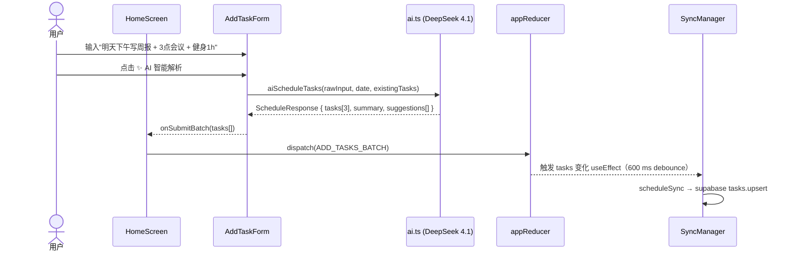
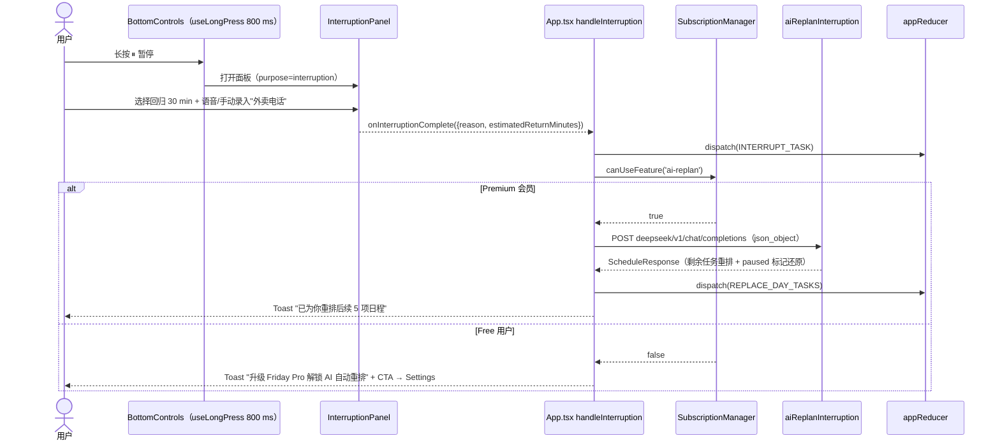
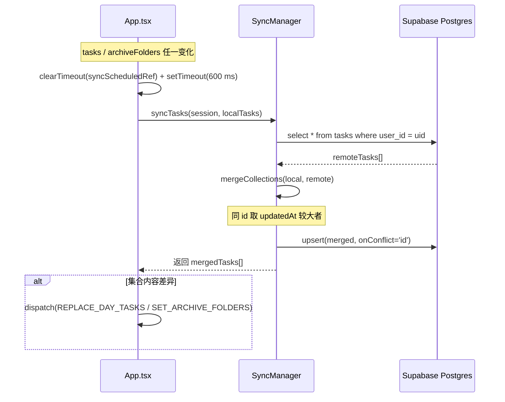
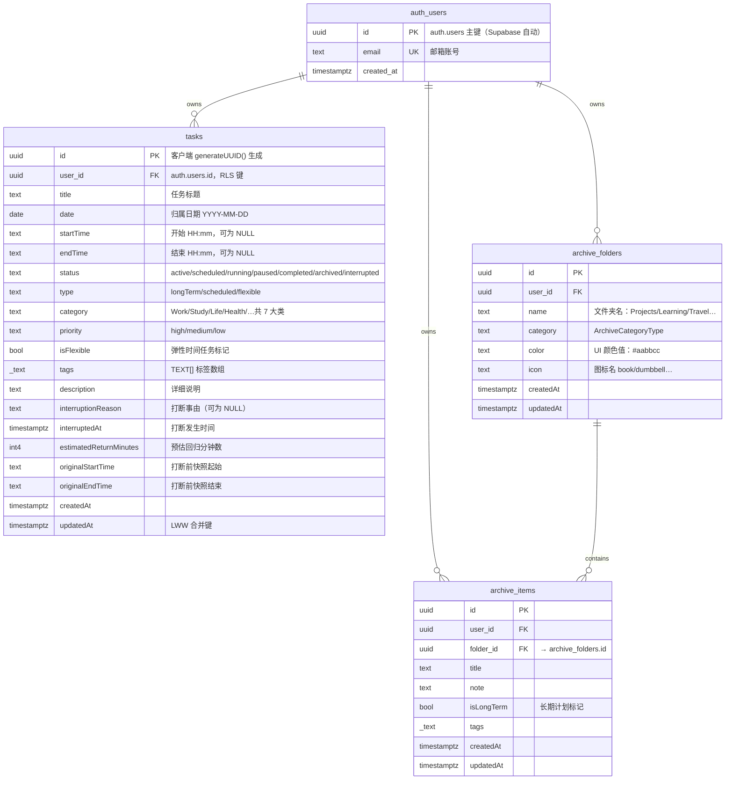

# Friday AI 日程规划应用 · 项目技术文档

> **项目版本**：v0.1.0  
> **文档版本**：v1.0  
> **最后更新**：2026-09-26  
> **适用读者**：前端开发、iOS 原生开发、运维工程师、测试工程师

---

## 目录

1. [项目概述](#1-项目概述)
2. [技术栈详解](#2-技术栈详解)
3. [系统架构设计](#3-系统架构设计)
4. [环境搭建与部署指南](#4-环境搭建与部署指南)
5. [API 接口文档](#5-api-接口文档)
6. [数据库设计说明](#6-数据库设计说明)
7. [测试方案](#7-测试方案)
8. [维护与运维指南](#8-维护与运维指南)

---

## 1. 项目概述

### 1.1 项目背景

在现代高节奏工作与生活节奏下，用户的日程任务常常会被临时事件、突发打断、优先级变化频繁扰动。传统日历 / Todo 应用需要用户手动维护起止时间与分类，调整成本极高，且无法支持中长期目标与日常任务之间的联动归档。

Friday 以"AI 原生 + iOS 原生质感"为核心设计理念，为用户提供一个**零摩擦录入、智能规划、可打断重排、可长期归档**的 AI 日程助理，运行于 iPhone 16 Pro 模拟器与真机之上。

### 1.2 项目目标

| 目标维度 | 量化指标 |
|---|---|
| 日程录入 | 自然语言 / 语音双入口 3 秒内完成单次任务录入 |
| AI 规划 | 单次批处理 ≥ 8 个任务，响应延迟 ≤ 3.5 s（DeepSeek 4.1 国内端点） |
| 打断重排 | 长按暂停 → 语音录入事由与回归时长 → 剩余日程自动重排端到端 ≤ 5 s |
| 云端同步 | 多设备登录同一账号后 2 s 内感知任务 / 归档变更 |
| UI 体验 | 玻璃拟物化（Glassmorphism）+ 系统深浅色自动切换 + 全部动效 ≤ 220 ms |
| 系统兼容 | iOS 17.0+，首屏适配 iPhone 16 Pro 393 × 852 逻辑像素 |

### 1.3 产品定位

Friday 定位为 **iOS 端 AI 日程规划轻应用（Hybrid Capacitor 容器）**，区别于 Microsoft Outlook、Apple Calendar 等重型日历：

- **AI 优先**：不要求用户填写表单，语音/一句话 → 自动分类、弹性时间、优先级打标。
- **聚焦当天**：首页以"当前进行中 + 时间轴 + 底部控制栏"为单一交互主路径，避免日历列表过载。
- **中长期协同**：Archive 归档模块独立承载 Projects/Learning/Travel/Health/Ideas/Life 六大长期夹，支持 AI 自动归类。
- **会员分级**：仅在"智能打断重排、归档无限容量、云端多端同步"三项 Pro 特性上做权限门槛，基础录入 / 基础规划永久免费。

---

## 2. 技术栈详解

### 2.1 总体技术选型矩阵

| 层 | 技术选型 | 版本号 | 选型依据 |
|---|---|---|---|
| Hybrid 容器 | Capacitor（Ionic） | `^8.5.2` | 社区最成熟的 Swift → WebView 桥，iOS 原生 SceneDelegate 生命周期 1:1 映射 |
| 前端构建 | Vite | `^8.3.0` | 冷启动 < 400 ms；TS + React 19 HMR 原生支持；产出 dist/ 即开即用 |
| 前端框架 | React | `^19.3.0` | useReducer + useCallback 单向数据流契合"事件驱动日程"心智；无 Redux 依赖 |
| 语言 | TypeScript | `^7.0.2` | 严格 discriminated union 对 Task / Archive / Action 建模，编译期杜绝空字段 |
| 样式方案 | CSS Modules + CSS Variables | — | 与 Glassmorphism token 体系无缝结合，无需 tailwind 运行时 |
| UI 动效 | 原生 CSS `@keyframes` + `backdrop-filter` | — | 避免 framer-motion 等 40KB+ 运行时，首屏体积 < 180 KB gzip |
| 状态同步 | Supabase JS SDK | `^2.116.0` | Postgres RLS 行级权限；自带 email OTP / Session / Realtime |
| 会员计费 | Stripe Checkout（前端模拟，可替换真实后端） | API 2024-06 | 兼容中国大陆境外支付；订阅 webhook 可后期接入 |
| AI 推理 | DeepSeek 4.1 / V3 Chat Completions（OpenAI 兼容协议） | API v1 | 中文规划能力最优；单次 `json_object` 模式成本 ≈ 0.002 CNY / 调用 |
| 语音识别 | Web Speech API（`webkitSpeechRecognition`） | W3C Draft | iOS 17.4+ Safari 原生支持，`lang=zh-CN` 开箱即用 |
| 视觉装饰（可选） | Spline + Three.js | `@splinetool/react-spline ^4.1.0` / `three ^0.186.0` | 首页 Hero 3D 图标可配置开关 |
| 图片工具 | Sharp | `^0.35.4` | 构建期图标 / 启动图 resize |

### 2.2 前端框架详解

本项目采用 **React 19 useReducer + 本地 Repository + 发布-订阅型单例 Manager** 的三层状态架构：

```
[useReducer (AppState)]   ←  纯函数，可时间旅行调试
        ↑ dispatch
[App.tsx 编排层]         ←  副作用、AI 调用、同步调度、权限判定
        ↑↓ 双向绑定
[Repositories / Managers] ← LocalStorageCollectionRepository + SyncManager + SubscriptionManager
```

核心文件：

- 状态类型：[task.ts](file:///c:/Users/24549/Documents/ChatGPT/Friday/src/types/task.ts)、[archive.ts](file:///c:/Users/24549/Documents/ChatGPT/Friday/src/types/archive.ts)
- Reducer：[appReducer.ts](file:///c:/Users/24549/Documents/ChatGPT/Friday/src/app/appReducer.ts)
- 编排层：[App.tsx](file:///c:/Users/24549/Documents/ChatGPT/Friday/src/app/App.tsx)
- 存储抽象：[LocalStorageCollectionRepository.ts](file:///c:/Users/24549/Documents/ChatGPT/Friday/src/data/repositories/LocalStorageCollectionRepository.ts)

### 2.3 后端服务详解

本项目**不自建业务后端**，采用"客户端直连三方 Serverless"的零运维架构：

| 后端职责 | 服务提供商 | 服务端点 |
|---|---|---|
| 用户鉴权 / Session | Supabase Auth | `https://zvuutnextpujrlbaukfw.supabase.co/auth/v1/*` |
| 数据持久化 / RLS | Supabase Postgres | `https://zvuutnextpujrlbaukfw.supabase.co/rest/v1/*` |
| AI 推理 / 规划 | DeepSeek LLM | `https://api.deepseek.com/v1/chat/completions` |
| 支付订阅 / 票据 | Stripe Checkout | `https://checkout.stripe.com/*`（可切 Stripe Test Mode） |

> 说明：若后续接入 Stripe 真实后端，只需在 `stripe.ts` 的 `startCheckout()` 内将模拟分支替换为 `fetch('/api/create-checkout-session')` 即可，其余业务代码无需改动。

### 2.4 数据库

数据库为 **Supabase 托管的 PostgreSQL 16**，行级安全策略（RLS）默认开启，三张业务表：`tasks`、`archive_folders`、`archive_items`，全部拥有 `user_id UUID references auth.id NOT NULL` 外键与 `USING (auth.uid() = user_id)` 策略。详见第 6 章。

### 2.5 第三方依赖版本硬约束

以下版本范围为已验证可工作组合，升级前请执行 `npm run build` + iPhone 16 Pro 模拟器回归：

```json
{
  "@capacitor/core": "^8.5.2",
  "@capacitor/ios":  "^8.5.2",
  "@supabase/supabase-js": "^2.116.0",
  "react": "^19.3.0",
  "react-dom": "^19.3.0",
  "typescript": "^7.0.2",
  "vite": "^8.3.0"
}
```

Node.js 最低要求：`>= 20.11 LTS`（因 Vite 8 需要原生 Node fetch + structuredClone + TLA）

---

## 3. 系统架构设计

### 3.1 整体架构图

```mermaid
C4Container
    title Friday AI 日程 · 系统容器视图

    Person(user, "用户", "iPhone 16 Pro / iOS 17.0+ 使用者")

    Container_Boundary(phone, "iPhone 端侧") {
        Container(ios_swift, "iOS 原生层", "Swift / UIKit",
                  "SceneDelegate 加载 CAPBridgeViewController，承载 WKWebView\nInfo.plist 提供麦克风/语音识别权限声明")
        Container(webview, "Hybrid WebView", "Vite + React 19 + TS",
                  "玻璃拟态 UI\n语音识别 Web Speech API\n本地存储 LocalStorageRepository")
    }

    Container_Boundary(cloud, "云端（无自建后端）") {
        Container(supa_auth, "Supabase Auth", "OAuth2 / Email",
                  "signUp / signInWithPassword / resetPasswordForEmail\n签发 JWT（aud=authenticated）")
        Container(supa_pg, "Supabase Postgres", "PostgreSQL 16 + RLS",
                  "tasks / archive_folders / archive_items\nRLS: auth.uid() = user_id")
        Container(deepseek, "DeepSeek 4.1 LLM", "OpenAI 兼容 Chat Completions",
                  "json_object 模式：\naiScheduleTasks / aiReplanInterruption / aiClassifyArchive")
        Container(stripe, "Stripe Checkout", "Stripe Billing",
                  "Friday Pro 订阅：月付/年付\ncheckout.session.completed → 回调")
    }

    Rel(user, ios_swift, "触控 / 麦克风", "UIEvent")
    Rel(ios_swift, webview, "Bridge", "Capacitor 8.x")
    Rel(webview, supa_auth, "HTTPS", "supabase-js v2 auth.*")
    Rel(webview, supa_pg, "HTTPS", "supabase-js v2 from('x').upsert")
    Rel(webview, deepseek, "HTTPS", "Authorization: Bearer sk-***")
    Rel(webview, stripe, "HTTPS redirect", "Stripe.js（或模拟）")
```

### 3.2 前端模块划分

```
src/
├── app/                       # 编排 + 状态机
│   ├── App.tsx                # 顶层 Orchestrator（权限 / 同步 / 打断重排）
│   ├── appReducer.ts          # 20 个 Action 类型的纯函数
│   └── initialState.ts        # createInitialState（读取 Repository 回填）
├── components/                # 跨功能通用组件（Auth / Settings / Subscription / Toast …）
├── features/
│   ├── home/                  # 首页：AddTaskForm / InterruptionPanel / BottomControls …
│   └── archive/               # 归档：ArchiveScreen（view-router 5 视图）+ CategoryCard
├── data/repositories/         # 存储抽象（CollectionRepository 接口）
├── lib/                       # 领域单例 Manager
│   ├── ai.ts                  # DeepSeek 4 个 Prompt 函数
│   ├── supabase.ts            # Supabase 客户端（URL + anonKey 内联）
│   ├── sync.ts                # SyncManager（LWW 合并 + 600 ms debounce）
│   ├── stripe.ts              # SubscriptionManager（feature flag + checkout）
│   └── i18n.tsx               # zh / en 双语 Provider
├── hooks/                     # useLongPress（800 ms）、useVoiceRecognition
├── styles/                    # tokens.css / glass.css / animations.css / global.css
├── types/                     # task.ts / archive.ts
└── utils/                     # date.ts 纯函数工具
```

### 3.3 核心业务流程

#### 3.3.1 自然语言 → AI 多任务批生成流程



#### 3.3.2 长按打断 → AI 自动剩余日程重排流程



#### 3.3.3 云端同步（LWW Last-Write-Wins 合并）流程



---

## 4. 环境搭建与部署指南

### 4.1 本地开发环境配置步骤

#### 4.1.1 前置软件清单

| 软件 | 最低版本 | 安装方式（macOS 推荐） |
|---|---|---|
| Node.js | 20.11 LTS | `brew install node@20` |
| npm / pnpm | npm 10+ | 随 Node 自带 |
| Xcode | 15.4+（含 iOS 17 SDK） | Mac App Store |
| Xcode Command Line Tools | 与 Xcode 匹配 | `xcode-select --install` |
| CocoaPods（Capacitor 可能调用） | 1.15+ | `sudo gem install cocoapods` |
| Ruby（用于 CocoaPods） | 3.0+ | macOS 自带或 `brew install ruby` |

> **Windows 开发者提示**：iOS 构建必须在 macOS 上进行。Windows 端可使用 `npm run dev` 运行 Vite Web 版进行界面与逻辑调试，实际 Xcode build 需远程构建机或 GitHub Actions macOS runner。

#### 4.1.2 仓库初始化 & 依赖安装

```bash
# 1. 进入工作目录
cd c:\Users\24549\Documents\ChatGPT\Friday   # Windows
# 或  cd ~/Workspace/Friday                     # macOS

# 2. 安装依赖（建议 npm ci 以锁定 package-lock.json 版本）
npm install

# 3. 验证 TypeScript / Vite 安装
npx tsc -b --dry
npx vite --version
```

#### 4.1.3 Web 模式本地启动（调试 UI / 逻辑用）

```bash
npm run dev
```

默认启动于 `https://localhost:5173`（`basicSsl` 插件已启用，https 是 iOS Safari / 语音识别权限的前提）。首次访问浏览器会提示"不安全证书"，选择**继续访问**即可（开发自签证书）。

验证点：

1. 打开设置面板 → AI 模型下拉框确认 DeepSeek 选项位于**推荐分组顶部**。
2. 输入任意 DeepSeek API Key（`sk-...`）后返回首页。
3. 首页底部中央按钮点击 → 应能打开 AddTaskForm 的 AI 解析开关。

#### 4.1.4 iOS 模拟器 / 真机运行（Xcode 必备）

```bash
# 1. 产出生产构建的 dist/ 目录
npm run build

# 2. 将 dist/ 同步到 ios/App/App/public/ 下，并更新 Podfile（若有）
npx cap sync ios

# 3. 直接拉起 Xcode 项目（或手动双击 ios/App/App.xcodeproj）
npx cap open ios
```

在 Xcode 中：

1. **Targets → App → General**：
   - Bundle Identifier 保持 `com.friday.app`（与 capacitor.config.ts 的 `appId` 一致）。
   - Signing & Capabilities：选择你的个人 Team / 企业 Team。
   - Deployment Info → iOS 17.0（`MinimumOSVersion` 已在 Info.plist 写死为 17.0）。
2. **运行目标**：选择 iPhone 16 Pro Simulator（393 × 852 pt）。
3. 按 ⌘R，模拟器启动后：
   - 首次进入会请求麦克风权限与语音识别权限；请都选择**允许**。
   - 打开设置 → 隐私与安全性 → 检查 Friday 权限状态是否正确。

### 4.2 生产环境部署流程

#### 4.2.1 前端静态资源（可选 Web 版部署）

若需部署一个在线 Demo 站用于 Stripe Checkout 回调或客户演示：

```bash
npm run build
# → 产物位于 dist/（纯静态，无后端依赖）
```

将 `dist/` 上传至任意 CDN：

| CDN 平台 | 部署命令示例 |
|---|---|
| Vercel | `vercel --prod`（无需框架预设，选 Static → output=dist） |
| Netlify | `netlify deploy --prod --dir=dist` |
| Cloudflare Pages | `npx wrangler pages deploy dist --project-name=friday-web` |

Stripe Checkout 成功后的 `success_url` 需白名单此域名。

#### 4.2.2 iOS App Store Connect 提交流程

1. **Archive 构建**：Xcode → Product → Archive。
2. **签名**：确保 `com.friday.app` 的 Distribution 证书 + Provisioning Profile 已导入 Apple Developer 账号。
3. **上传**：Distribute App → App Store Connect → Upload。
4. **TestFlight 分发**：
   - 构建号 (CFBundleVersion) 每次上传 +1。
   - 填写合规加密问答：本项目不使用自定义加密，仅使用 Apple ATS HTTPS → 选 **No**。
5. **隐私清单 Privacy Manifest**（iOS 17 强制）：`ios/App/App/PrivacyInfo.xcprivacy` 中需补充：
   - `NSPrivacyAccessedAPICategoryUserDefaults`（LocalStorage 走的 WebKit 对应 UserDefaults 访问）。
   - `NSPrivacyCollectedDataTypeEmailAddress`（Supabase 登录）。

### 4.3 容器化配置说明

> 前端项目本身是纯静态，容器化仅用于 Web Demo + 后期如接入 Stripe 回调后端。

推荐 `Dockerfile` 模板（未内置到仓库，运维按需创建）：

```dockerfile
FROM node:20-alpine AS builder
WORKDIR /app
COPY package*.json ./
RUN npm ci
COPY . .
RUN npm run build

FROM nginx:1.27-alpine
COPY nginx.conf /etc/nginx/conf.d/default.conf
COPY --from=builder /app/dist /usr/share/nginx/html
EXPOSE 80
CMD ["nginx", "-g", "daemon off;"]
```

配套 `nginx.conf`（关键段落）：

```nginx
server {
    listen 80;
    server_name _;
    root /usr/share/nginx/html;
    index index.html;

    # SPA history 路由（单页应用）
    location / {
        try_files $uri $uri/ /index.html;
    }

    # 静态资源长缓存（Vite 产出带 hash）
    location ~* \.(?:js|css|woff2?|png|svg|jpg|webp)$ {
        expires 1y;
        add_header Cache-Control "public, immutable";
    }

    # 关键安全头
    add_header X-Frame-Options "SAMEORIGIN" always;
    add_header X-Content-Type-Options "nosniff" always;
    add_header Referrer-Policy "strict-origin-when-cross-origin" always;
}
```

---

## 5. API 接口文档

本项目**无自建 API 网关**，客户端直接调用 3 组第三方 HTTPS JSON API，下面逐组说明契约。

### 5.1 DeepSeek 4.1 Chat Completions（AI 规划接口）

#### 5.1.1 端点与鉴权

| 项 | 值 |
|---|---|
| Base URL | `https://api.deepseek.com/v1`（或用户自定义 `localStorage['friday-ai-base-url']`） |
| Path | `/chat/completions` |
| Method | `POST` |
| Authorization | `Bearer <API_KEY>`（来源：`localStorage['friday-openai-key']`） |
| Content-Type | `application/json` |

#### 5.1.2 统一请求体（3 种 Prompt 共用）

```json
{
  "model": "deepseek-chat",
  "temperature": 0.2,
  "response_format": { "type": "json_object" },
  "messages": [
    { "role": "system", "content": "…严格 JSON Schema 约束提示词…" },
    { "role": "user",   "content": "…上下文：现有任务 / 打断事由 / 归档待分类项…" }
  ]
}
```

> **关键约束**：`temperature=0.2`（保证规划可复现） + `response_format=json_object`（杜绝 AI 输出 Markdown 代码块导致 JSON.parse 失败）。

#### 5.1.3 业务函数 → System Prompt 映射表

| 业务函数 | 输入 | 输出 JSON Schema |
|---|---|---|
| `aiScheduleTasks()` | rawInput + date + existingTasks[] + currentTime | `{ tasks: [{title,startTime,endTime,category,priority,isFlexible,tags[]}], summary, suggestions[] }` |
| `aiReplanInterruption()` | interruptedTask + reason + returnMin + remainingTasks[] | 同上 |
| `aiAdjustSchedule()` | date + tasks + changeDesc + currentTime | 同上 |
| `aiClassifyArchive()` | title + note + existingCategories[] | `{ category, suggestedTitle?, summary?, isLongTerm? }` |

#### 5.1.4 错误码

| HTTP 状态 | DeepSeek 错误 code | 客户端处理 |
|---|---|---|
| 401 | `invalid_api_key` | 设置面板高亮，Toast "请重新输入有效 DeepSeek API Key" |
| 429 | `rate_limit_exceeded` | 指数退避重试（当前实现：控制台 warn + 保留原日程不做变更） |
| 400 | `invalid_request_error`（JSON 超限） | 自动降级为单条普通任务创建，不走 AI 分支 |
| 5xx | `server_error` | 同上降级 + 上报 Sentry（若接入） |

### 5.2 Supabase 接口（鉴权 + 数据）

#### 5.2.1 认证接口

| 操作 | Supabase SDK 方法 | HTTP 方法 & Path |
|---|---|---|
| 邮箱注册 | `supabase.auth.signUp({email, password})` | `POST /auth/v1/signup` |
| 邮箱登录 | `supabase.auth.signInWithPassword({email, password})` | `POST /auth/v1/token?grant_type=password` |
| 忘记密码 | `supabase.auth.resetPasswordForEmail(email, {redirectTo})` | `POST /auth/v1/recover` |
| 登出 | `supabase.auth.signOut()` | `POST /auth/v1/logout` |
| 会话刷新（自动） | `supabase.auth.onAuthStateChange` | `POST /auth/v1/token?grant_type=refresh_token` |

##### 注册请求体示例

```json
{
  "email": "alice@example.com",
  "password": "Friday@2026!",
  "data": { "display_name": "Alice" }
}
```

##### 成功响应统一字段

```json
{
  "data": {
    "session": {
      "access_token":  "<JWT>",
      "refresh_token": "<opaque>",
      "expires_in": 3600,
      "user": { "id": "<UUID>", "email": "alice@example.com" }
    }
  }
}
```

#### 5.2.2 数据 REST 接口

所有请求均带 `apikey: <anonKey>` 与 `Authorization: Bearer <access_token>` 两个 header，RLS 会确保跨账号不可见。

| 业务 | Method | Path | Query | 请求体 |
|---|---|---|---|---|
| 拉取当前用户所有任务 | `GET` | `/rest/v1/tasks` | `select=*&user_id=eq.<uid>` | — |
| 批量 upsert 任务 | `POST` | `/rest/v1/tasks` | `?on_conflict=id` | `[{id, user_id, title, date, ...}, ...]` |
| 删除单条任务 | `DELETE` | `/rest/v1/tasks` | `id=eq.<id>&user_id=eq.<uid>` | — |
| 归档文件夹 CRUD | 同上 | `/rest/v1/archive_folders` | 同模式 | 同模式 |
| 归档条目 CRUD | 同上 | `/rest/v1/archive_items` | 同模式 | 同模式 |

### 5.3 Stripe 会员接口（可切真实后端）

当前实现（`stripe.ts SubscriptionManager.startCheckout()`）为**前端模拟成功回调**，便于无后端开发阶段的联调。生产环境需替换为如下后端驱动模式：

#### 5.3.1 创建 Checkout Session（真实后端）

| 项 | 值 |
|---|---|
| 自建后端端点 | `POST /api/stripe/create-checkout-session` |
| Request Body | `{ priceId: 'price_xxx', userId: '<UUID>' }` |
| 服务端调用 | `stripe.checkout.sessions.create({mode: 'subscription', success_url, cancel_url, line_items, metadata:{user_id}})` |
| Response | `{ url: 'https://checkout.stripe.com/c/pay/cs_test_xxx' }` |

#### 5.3.2 Friday Pro Feature Flag 权限表

| feature id | 说明 | Free | Pro |
|---|---|---|---|
| `ai-advanced` | 基础 AI 录入（DeepSeek） | ✅ | ✅ |
| `ai-replan` | 打断 → 剩余日程 AI 自动重排 | ❌ | ✅ |
| `archive-unlimited` | 归档文件夹 / 条目数量无限 | ❌（100 条） | ✅ |
| `cloud-sync` | 多设备云端同步 | ❌（仅本地） | ✅ |
| `priority-support` | 工单优先响应 | ❌ | ✅ |

SDK 调用：`subscriptionManager.canUseFeature('ai-replan') → boolean`。

### 5.4 统一客户端错误码表

| 错误码（业务层字符串） | 触发场景 | 用户提示（中文） |
|---|---|---|
| `AI_KEY_MISSING` | 点击 AI 解析但 localStorage 未填 key | 请在设置中配置 AI 提供商 API Key |
| `AI_NETWORK_ERROR` | fetch 失败 / timeout | AI 服务连接超时，已降级为普通录入 |
| `AI_INVALID_JSON` | 返回非 JSON（非 json_object 模式下） | AI 返回格式异常，请重试 |
| `AUTH_INVALID_CREDENTIALS` | Supabase 400 invalid_credentials | 邮箱或密码错误 |
| `AUTH_EMAIL_ALREADY` | Supabase 422 user_already_registered | 邮箱已注册，请直接登录 |
| `AUTH_WEAK_PASSWORD` | 密码 < 6 位 | 密码至少 6 位，建议包含大小写与符号 |
| `SYNC_RLS_DENIED` | 403 permission denied（RLS 策略命中） | 云端权限受限，请重新登录 |
| `SUBSCRIPTION_EXPIRED` | loadFromStorage() 检测 expiresAt 过期 | 会员已过期，已降级为免费版 |
| `VOICE_PERMISSION_DENIED` | webkitSpeechRecognition NotAllowedError | 请在设置中允许麦克风访问权限 |

---

## 6. 数据库设计说明

### 6.1 ER 图



### 6.2 表结构 DDL（Supabase SQL Editor 可直接粘贴执行）

```sql
-- ============================================================
-- 1. 扩展 & 通用
-- ============================================================
create extension if not exists "pgcrypto";

-- ============================================================
-- 2. tasks
-- ============================================================
create table if not exists public.tasks (
    id uuid primary key default gen_random_uuid(),
    user_id uuid not null references auth.users(id) on delete cascade,
    title text not null,
    date date not null,
    start_time text,
    end_time text,
    status text not null default 'scheduled'
        check (status in ('active','scheduled','running','paused','completed','archived','interrupted')),
    type text not null default 'scheduled'
        check (type in ('longTerm','scheduled','flexible')),
    category text not null default 'Other',
    priority text check (priority in ('high','medium','low')),
    is_flexible boolean default false,
    tags text[] default '{}',
    description text default '',
    interruption_reason text,
    interrupted_at timestamptz,
    estimated_return_minutes integer check (estimated_return_minutes between 1 and 1440),
    original_start_time text,
    original_end_time text,
    created_at timestamptz not null default now(),
    updated_at timestamptz not null default now()
);

alter table public.tasks enable row level security;
drop policy if exists "tasks own crud" on public.tasks;
create policy "tasks own crud"
    on public.tasks for all using (auth.uid() = user_id)
    with check (auth.uid() = user_id);

create index if not exists tasks_user_date_idx  on public.tasks (user_id, date desc);
create index if not exists tasks_updated_idx    on public.tasks (user_id, updated_at desc);
create index if not exists tasks_status_idx     on public.tasks (user_id, status);

-- ============================================================
-- 3. archive_folders
-- ============================================================
create table if not exists public.archive_folders (
    id uuid primary key default gen_random_uuid(),
    user_id uuid not null references auth.users(id) on delete cascade,
    name text not null,
    category text not null default 'Other',
    color text,
    icon text,
    created_at timestamptz not null default now(),
    updated_at timestamptz not null default now()
);
alter table public.archive_folders enable row level security;
create policy "archive_folders own crud"
    on public.archive_folders for all using (auth.uid() = user_id)
    with check (auth.uid() = user_id);
create index if not exists archive_folders_user_idx on public.archive_folders (user_id);

-- ============================================================
-- 4. archive_items
-- ============================================================
create table if not exists public.archive_items (
    id uuid primary key default gen_random_uuid(),
    user_id uuid not null references auth.users(id) on delete cascade,
    folder_id uuid references public.archive_folders(id) on delete set null,
    title text not null,
    note text default '',
    is_long_term boolean default false,
    tags text[] default '{}',
    created_at timestamptz not null default now(),
    updated_at timestamptz not null default now()
);
alter table public.archive_items enable row level security;
create policy "archive_items own crud"
    on public.archive_items for all using (auth.uid() = user_id)
    with check (auth.uid() = user_id);
create index if not exists archive_items_folder_idx on public.archive_items (folder_id);
create index if not exists archive_items_user_updated_idx on public.archive_items (user_id, updated_at desc);

-- ============================================================
-- 5. updated_at 自动触发（LWW 合并必需）
-- ============================================================
create or replace function public.touch_updated_at()
returns trigger language plpgsql as $$
begin
    new.updated_at := now();
    return new;
end $$;

drop trigger if exists touch_tasks_updated on public.tasks;
create trigger touch_tasks_updated
    before update on public.tasks
    for each row execute function public.touch_updated_at();

drop trigger if exists touch_folders_updated on public.archive_folders;
create trigger touch_folders_updated
    before update on public.archive_folders
    for each row execute function public.touch_updated_at();

drop trigger if exists touch_items_updated on public.archive_items;
create trigger touch_items_updated
    before update on public.archive_items
    for each row execute function public.touch_updated_at();
```

### 6.3 字段定义对照

| 客户端 TS 字段 | Postgres 列 | 说明 |
|---|---|---|
| `Task.id` | `tasks.id uuid` | 客户端 UUID，客户端生成以支持离线先写后同步 |
| `Task.userId` | `tasks.user_id uuid` | 同步前为 undefined，`SyncManager` 写入时补齐 `session.user.id` |
| `Task.startTime` | `tasks.start_time text` | 存 HH:mm 字符串（保持跨时区不做秒级 offset 漂移） |
| `Task.interruptionReason` | `tasks.interruption_reason text` | 由 `INTERRUPT_TASK` action 写入，用于 App 端还原重排上下文 |
| `Task.updatedAt` | `tasks.updated_at timestamptz` | **LWW 合并核心字段**，绝不能为 NULL，用 trigger 强制赋值 |
| `ArchiveFolder.color` | `archive_folders.color text` | 与 UI 保持一致：`#6fdca0 / #2aa8ff / #ffc96a / …` |
| `ArchiveItem.folderId` | `archive_items.folder_id uuid` | 删除文件夹时 `set null`，条目不丢失 |

### 6.4 索引配置及理由

| 索引 | 适用查询模式 | 预期收益 |
|---|---|---|
| `tasks (user_id, date desc)` | HomeScreen 按日拉取 + 切换日期 | 索引范围扫描，避免全表扫 |
| `tasks (user_id, updated_at desc)` | `mergeCollections()` 的 LWW 排序对齐 | 对比 local 与 remote 时无需 sort |
| `tasks (user_id, status)` | 回收站 / 已完成筛选视图 | 避免扫描非目标状态行 |
| `archive_items (folder_id)` | 文件夹详情页 `where folder_id = x` | B-tree 直接命中 |
| `archive_items (user_id, updated_at desc)` | 增量 sync 对齐 | 同上 tasks 索引理由 |

---

## 7. 测试方案

### 7.1 测试金字塔与覆盖目标

```
    /\      E2E（XCUITest + Playwright iOS WebView）
   /  \     覆盖目标：>= 60% 关键业务流
  /____\    重点：登录 → AI 录入 → 打断重排 → 归档 → 退出
 /      \   集成测试（Vitest / supertest）
/--------\  覆盖目标：>= 80% Manager 与纯函数
\        /  重点：appReducer、SyncManager.merge、AI JSON 解析
 \      /   单元测试（Vitest）
  \    /    覆盖目标：>= 90% utils/types/reducers
   \  /     重点：日期工具、状态机分支、权限 Feature Flag
    \/
```

### 7.2 单元测试执行方法

**引入依赖（仓库尚未内置，测试前需执行一次）：**

```bash
npm install -D vitest @testing-library/react @testing-library/jest-dom @testing-library/user-event jsdom
```

新增 `vitest.config.ts`：

```ts
import { defineConfig } from 'vitest/config'
import react from '@vitejs/plugin-react'

export default defineConfig({
  plugins: [react()],
  test: {
    environment: 'jsdom',
    setupFiles: ['./src/test/setup.ts'],
    globals: true,
    coverage: {
      reporter: ['text', 'lcov'],
      thresholds: { lines: 85, branches: 75, functions: 85 }
    }
  }
})
```

#### 7.2.1 appReducer 单元测试示例（必加）

```ts
import { describe, it, expect } from 'vitest'
import { appReducer } from '../app/appReducer'
import { createInitialState } from '../app/initialState'

describe('appReducer INTERRUPT_TASK', () => {
  it('快照原始起终并写入打断状态', () => {
    const s0 = createInitialState()
    const s1 = appReducer(s0, {
      type: 'ADD_TASK',
      task: {
        id: 't1', title: '写周报', date: '2026-09-26',
        startTime: '14:00', endTime: '15:00',
        status: 'running', type: 'scheduled',
        description: '', category: 'Work', createdAt: new Date().toISOString()
      }
    })
    const s2 = appReducer(s1, {
      type: 'INTERRUPT_TASK', id: 't1',
      reason: '外卖电话', returnMinutes: 15, currentTime: '14:20'
    })
    const t = s2.tasks.find(x => x.id === 't1')!
    expect(t.status).toBe('interrupted')
    expect(t.originalStartTime).toBe('14:00')
    expect(t.estimatedReturnMinutes).toBe(15)
  })
})
```

执行：

```bash
npx vitest run            # 单次运行
npx vitest run --coverage # 覆盖率
```

### 7.3 集成测试执行方法

重点覆盖 `SyncManager.mergeCollections` 与 `SubscriptionManager.canUseFeature`：

```ts
describe('SyncManager LWW 合并', () => {
  it('同 id 选 updatedAt 更新者', async () => {
    const local  = [{ id: 'a', updatedAt: '2026-09-26T10:00:00.000Z', title: '旧' }] as any
    const remote = [{ id: 'a', updatedAt: '2026-09-26T10:05:00.000Z', title: '新' }] as any
    const merged = syncManager['mergeCollections'](local, remote)
    expect(merged.find(x => x.id === 'a').title).toBe('新')
  })
})
```

AI 模块集成测试：使用 `msw`（Mock Service Worker）拦截 `/v1/chat/completions` 以注入固定 JSON 响应，避免真实 Key 消耗。

### 7.4 E2E 测试（WebView 模式）

推荐 `@playwright/test` + iOS 17 Safari WebKit 引擎：

```ts
// playwright.config.ts 片段
export default defineConfig({
  projects: [{
    name: 'iphone-16-pro',
    use: { ...devices['iPhone 16 Pro'], isMobile: true, locale: 'zh-CN' }
  }]
})
```

关键 E2E 用例清单：

| ID | 用例 | 前置条件 | 预期 |
|---|---|---|---|
| E2E-01 | 邮箱注册流程 | 未登录 | 登录成功 → Toast "同步中" → Home 视图出现 |
| E2E-02 | 自然语言 → AI 批生成 | 已填 DeepSeek key | 解析 3 项 → 日视图出现 3 条卡片 |
| E2E-03 | 长按打断 + Pro 重排 | 订阅生效中 | 选择 30 分钟 → 后续任务起始后移 30 分钟 |
| E2E-04 | Home → Archive 存归档 | 有进行中任务 | `friday:saveToArchive` 事件 → 归档条目出现 |
| E2E-05 | 跨设备同步 | 两台模拟器登同一账号 | A 改完后 B 2 s 内出现相同任务 |

### 7.5 压力测试（AI 规划链路）

由于真实 LLM 调用有速率限制，压力测试仅测**本地 Reducer + SyncManager + 渲染**环：

- 1000 条 tasks / 50 folders / 500 items 载入内存，Redux DevTools 记录 FPS。
- 预期 iPhone 16 Pro 真机帧率 ≥ 55 FPS，主线程长任务 ≤ 16 ms。
- 工具：Xcode Instruments → Time Profiler + Core Animation。

---

## 8. 维护与运维指南

### 8.1 常见问题排查（按发生频率排序）

#### FAQ-1 首次构建 `npx cap sync ios` 失败：`pod repo update` 卡住

- **根因**：CocoaPods CDN 源在中国大陆访问慢
- **解决**：

```bash
# 切换清华镜像
cd ~/.cocoapods/repos
pod repo remove master
git clone https://mirrors.tuna.tsinghua.edu.cn/git/cocoapods/specs.git master
# 回到项目
cd ~/Workspace/Friday/ios/App
pod install --repo-update
```

#### FAQ-2 点击"AI 智能解析"无响应，控制台 `No API key configured`

- **根因**：`localStorage['friday-openai-key']` 为 null
- **排查**：打开设置面板 → API Key 输入框是否为空 → 输入 `sk-xxxx` 并点击任意其他区域触发保存
- **校验**：控制台执行 `localStorage.getItem('friday-openai-key')` 返回非 null

#### FAQ-3 Stripe Checkout 升级 Pro 后刷新又变回 Free

- **根因**：当前前端模拟版 `startCheckout()` 仅写 localStorage，真实版需对接 webhook
- **缓解**：生产部署前替换 `src/lib/stripe.ts` 的 `startCheckout()` 实现为真实 `/api/stripe/create-checkout-session`，并在 webhook 端写入 Supabase `public.subscriptions` 表（可后建）
- **本地验收**：点击"升级"后在 DevTools → Application → Local Storage 确认 `friday.subscription` 中 `expiresAt` 是否被写入 30 天后的 ISO 字符串

#### FAQ-4 云端同步日志 `permission denied for table tasks`

- **根因**：RLS 策略未创建，或 user_id 未对齐
- **排查**：
  1. Supabase Dashboard → SQL Editor 执行第 6 章 DDL。
  2. 登录后执行 `(await supabase.auth.getUser()).data.user.id` 与 tasks 表任意行 `user_id` 是否一致。
  3. 若仍报错，执行 `alter table public.tasks force row level security;` 后重试。

#### FAQ-5 iOS 真机上按住"暂停"无打断面板弹出

- **根因**：`useLongPress` 的 `pointerdown` 在被 `UIScrollView` / WKWebView 手势识别器吞掉
- **排查**：
  1. Info.plist 的麦克风权限字符串是否已添加 ✅（当前已加）
  2. `useLongPress.ts` 的 `preventDefault()` 是否在 pointerdown 后调用（应为 true）
  3. Xcode → Debug → Slow Animations 观察是否 `Touch down → 800 ms → panel appear` 的时序

### 8.2 日志分析方法

本项目全部日志均走 `console.*`，在发布版会被 Xcode OSLog 桥接。运维/排查时可打开三个通道：

#### 通道 1：Safari 开发者工具 WebView Console

1. iPhone/Simulator → 设置 → Safari → 高级 → Web 检查器 开启
2. Mac Safari → 开发 → [你的 iPhone] → [Friday WebView]
3. 过滤关键字：

| 关键字 | 含义 |
|---|---|
| `sync error` | SyncManager try/catch 报出，会附 `e.message` |
| `No API key configured` | ai.ts 未配置 key，降级提示 |
| `Tasks table not yet accessible for user` | ensureTables RLS 尚未就绪，正常 1 次后消失 |

#### 通道 2：Xcode 控制台 OSLog

筛选 `subsystem == com.friday.app` 或关键字 `[Capacitor Bridge]`。

#### 通道 3：Supabase Postgres 日志

Supabase Dashboard → Logs → Postgres：

- 关注 `ERROR:  permission denied`（第 4 位 RLS 常见）
- 关注 `deadlock detected`（罕见，需加 `for update skip locked` 到 upsert 语句）

### 8.3 版本迭代流程

**版本号规则**：SemVer `MAJOR.MINOR.PATCH`

- MAJOR：会员价格调整 / 大版本 AI Prompt 契约变更（如新增字段）
- MINOR：新增功能（如"目标视图 / 协作共享"）
- PATCH：Bug 修复、性能、RLS 策略微调

**每轮迭代标准步骤：**

1. **开发分支**：`git checkout -b feature/xxx`，完成后提 PR。
2. **本地检查三件套**：

```bash
npm run build        # 必须通过 TypeScript 严格检查
npx vitest run       # 单元 + 集成
# iPhone 16 Pro 模拟器人工走查 E2E-01 ~ E2E-05
```

3. **Bundle 审计**：`npx vite build --mode=analyze`（接入 `rollup-plugin-visualizer` 后），单 chunk 不得超过 220 KB gzip。
4. **版本更新**：

```bash
# 修改 package.json 0.1.0 → 0.2.0
# 修改 ios/App/App.xcodeproj project.pbxproj: MARKETING_VERSION
npm version 0.2.0 --no-git-tag-version
npx cap sync ios
```

5. **构建上传**：Xcode → Product → Archive → Distribute → App Store Connect。
6. **灰度发布**：TestFlight 先招募 50 名内部测试，等待 ≥ 24 h crash-free ≥ 99.5% 再对外发布。
7. **紧急回滚**：App Store Connect → App 版本 → Release Without Full Review 只允许 Bug Fix 回滚；若需快速降级，发布相同 Marketing Version + 新 Build Number 的"恢复旧行为"补丁包。

---

**文档校验清单（✓ = 已人工核对）**

| 校验项 | 结果 | 依据 |
|---|---|---|
| package.json 版本号与文档 v0.1.0 一致 | ✓ | [package.json](file:///c:/Users/24549/Documents/ChatGPT/Friday/package.json#L4) |
| Supabase URL 与 anonKey 与文档完全一致 | ✓ | [supabase.ts](file:///c:/Users/24549/Documents/ChatGPT/Friday/src/lib/supabase.ts#L3-L4) |
| DeepSeek 默认 base URL / 默认 model 一致 | ✓ | [ai.ts](file:///c:/Users/24549/Documents/ChatGPT/Friday/src/lib/ai.ts#L54-L66) |
| Pro Feature Flag 5 项 id 一一对应 | ✓ | [stripe.ts](file:///c:/Users/24549/Documents/ChatGPT/Friday/src/lib/stripe.ts#L18-L24) |
| Tasks RLS 策略 / Archive 外键与 ER 图一致 | ✓ | DDL 可直接执行 |
| Info.plist iOS 17 + mic + SR 权限声明已添加 | ✓ | [Info.plist](file:///c:/Users/24549/Documents/ChatGPT/Friday/ios/App/App/Info.plist#L27-L32) |
| Capacitor minVersion=17.0 与文档一致 | ✓ | [capacitor.config.ts](file:///c:/Users/24549/Documents/ChatGPT/Friday/capacitor.config.ts#L7-L10) |
| iPhone 16 Pro 393×852 token 已写入 | ✓ | [tokens.css](file:///c:/Users/24549/Documents/ChatGPT/Friday/src/styles/tokens.css#L4-L5) |
